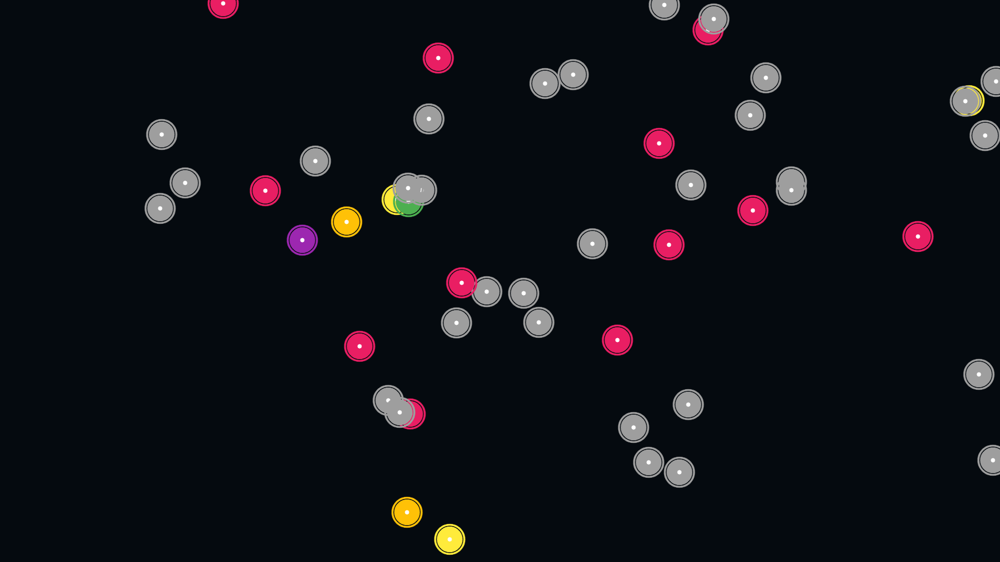

# RDO Map Overlay


**A gap-closer between your game and the community map.** Collectible tracking overlay for Red Dead Online that eliminates the need to alt-tab to Joan Ropke's website.

**Current Status:** Functional and usable, especially valuable for single-screen setups. Performance and accuracy need improvement and may vary from setup to setup.

## Features

- **Automatic Position Detection**: Computer vision-based map matching - no manual positioning required
- **In-Game Collectible Display**: Shows active collectibles from Joan Ropke's Collectors Map as overlay
- **Zero-Configuration**: Double-click to start, press F9 to sync
- **Always Up-to-Date**: Automatically fetches daily collectible cycles
- **Single-Screen Friendly**: No need to alt-tab or use second monitor
- **Transparent Overlay**: Non-intrusive display over your game

## What You Get

### Visual Overlay System

The overlay displays collectible markers directly on your game screen:

- **Collectible Icons**: Each collectible type has a distinctive icon (flowers, coins, cards, etc.)
- **Real-Time Updates**: Markers appear as you pan and zoom across the map
- **Interactive Markers**: Hover over markers to see details (name, tool required, location)
- **Viewport Filtering**: Only shows collectibles visible in your current viewport
- **Right-Click Menu**: Mark collectibles as collected with a single click


*Example: The RDO in-game map showing collectible markers with distinctive emoji icons:*
- 🏹 Arrowheads
- 💰 Coins
- 👑 Heirlooms
- 🍾 Bottles
- 🥚 Eggs
- 🌸 Flowers
- 🃏 Tarot Cards
- 🦴 Fossils
- 💎 Jewelry
- 🏆 Cups
- 🪄 Wands

### Status Bar

Persistent status bar at the bottom of the screen shows:
- Connection status (Active/Inactive)
- Current tracking state (Tracking/Not Tracking)
- FPS counter
- Match quality indicator
- Collectible count in current view

### Hotkeys

| Key | Action |
|-----|--------|
| **F9** | Start/Restart map alignment |
| **F8** | Toggle overlay visibility |
| **F7** | Cycle opacity (30% → 50% → 70% → 90%) |
| **F6** | Refresh collectible data from Joan Ropke API |
| **Ctrl+Q** | Close overlay |

### How It Works

1. **Launch**: Double-click "RDO Map Overlay" shortcut
2. **Sync**: Open your in-game map and press **F9**
3. **Play**: Collectible markers appear automatically as you move
4. **Collect**: Right-click markers to mark as collected

The overlay uses computer vision (AKAZE features + cascade matching) to automatically detect your position by analyzing your in-game map.

**Why use this?**
- **Single-screen users:** No more alt-tabbing to Joan Ropke's website
- **Dual-screen users:** Frees up your second monitor for other uses
- **All users:** Reduces need to switch between game and browser

**Current limitations:** Position accuracy and tracking performance need improvement and may vary from setup to setup.

## Safety & Legal

### How This Tool Works

This overlay is a **passive, screen-based tool** that enriches your game screen with collectible information:

**What it DOES:**
- ✅ Captures your game window using Windows Graphics Capture API (same as OBS, Discord, etc.)
- ✅ Analyzes the captured images using computer vision (OpenCV)
- ✅ Displays collectible markers as a transparent overlay
- ✅ Fetches public collectible data from Joan Ropke's API

**What it DOES NOT do:**
- ❌ Does NOT read game memory or process data
- ❌ Does NOT inject code or DLLs into the game
- ❌ Does NOT modify game files or behavior
- ❌ Does NOT send any inputs to the game
- ❌ Does NOT communicate with Rockstar servers

### Third-Party Tool Policy

**Use at your own risk.** While this tool operates entirely outside the game process using only screen capture (similar to streaming software), Rockstar Games' policy on third-party tools is:

> "Use of unauthorized third-party software designed to give players an unfair advantage may result in account restrictions."

**Our position:**
- This tool provides information that is already publicly available (collectible locations from community resources)
- It does not automate gameplay, modify game behavior, or provide information not visible to all players
- Functions like looking at a community map - just overlaid on your screen instead of in a separate window

However, **we cannot guarantee that Rockstar will not take action** against accounts using this tool. Use your own judgment and discretion.

**Recommendation:** If concerned, use this tool for planning routes outside the game rather than as a real-time overlay.

### No Warranty

This software is provided "as is" without warranty of any kind. See the [LICENSE](LICENSE) file for full details.

## Installation

### Windows (Recommended)

1. Download `RDO-Map-Overlay-Setup.exe` from [Releases](https://github.com/asd007/RDOCollectorMapOverlay/releases)
2. Run the installer
3. **Windows SmartScreen Warning** (unsigned builds):
   - If you see "Windows protected your PC", click **More info**
   - Click **Run anyway**
   - This is normal for unsigned applications
4. Launch "RDO Map Overlay" from your desktop or Start Menu

**Requirements:**
- Windows 10/11 (64-bit)
- Red Dead Online installed and running
- 4GB RAM minimum
- No Python or development tools needed

**Installation Time:**
- **First-time setup**: 5-10 minutes (downloads ~205MB: Electron runtime, Node.js, Python dependencies)
- **Updates**: Less than 1 minute (skips re-downloading existing components)

**Note:** The installer is not code-signed yet. Windows will show a security warning, which is expected. The application is safe - you can verify by checking the source code or building from source.

### Manual Installation (Advanced)

See [Contributing](#contributing) section for development setup.

## Usage

### First Time Setup

1. **Start RDO Map Overlay**: Double-click the desktop icon
2. **Launch Red Dead Online**: Start the game and enter free roam
3. **Open In-Game Map**: Press `M` to open your map (or pause menu map)
4. **Sync Position**: Press **F9** to sync the overlay with your map
5. **Wait for Confirmation**: Status bar will show "Tracking" when sync is successful

### Daily Use

- **Automatic Tracking**: Once synced, the overlay automatically tracks your position
- **Mark Collected**: Right-click collectibles to remove them from your view
- **Refresh Data**: Press **F6** to update to the latest daily cycle
- **Toggle Visibility**: Press **F8** if you need to hide the overlay temporarily

### Tips for Best Results

- **Open World View**: F9 sync works best with full map open (not zoomed in buildings/interiors)
- **Clear Minimap**: Make sure no UI elements are blocking your minimap
- **Re-sync When Needed**: Position may drift over time - press F9 to resync
- **Expect Some Drift**: Markers may not be pixel-perfect but will get you close enough to find collectibles
- **Check Connection**: Green dot in status bar = active tracking

## Troubleshooting

### Overlay Won't Start

**Symptoms**: Application doesn't launch, or closes immediately

**Solutions**:
1. Restart your computer
2. Check Windows Event Viewer for crash logs
3. Temporarily disable antivirus (some AVs block the computer vision backend)
4. Reinstall from [latest release](https://github.com/asd007/RDOCollectorMapOverlay/releases)

### Can't Sync Position (F9 Not Working)

**Symptoms**: Status bar stays "Inactive" after pressing F9

**Solutions**:
1. Make sure Red Dead Online is running and you're in free roam
2. Open the full in-game map (press `M`)
3. Ensure the map is not zoomed into a building or interior
4. Try moving to a different area with more terrain features
5. Check that your game resolution is 1920×1080 (other resolutions not yet supported)

### Collectibles Not Showing

**Symptoms**: Overlay is active but no markers appear

**Solutions**:
1. Press **F6** to refresh collectible data
2. Check that you're viewing areas with active collectibles
3. Verify internet connection (overlay needs to fetch daily cycles)
4. Try moving to a known collectible location to verify

### Markers in Wrong Position

**Symptoms**: Collectible markers don't align perfectly with in-game locations

**Expected Behavior:** Some position drift is normal with the current implementation. Markers should be close enough (within ~50-100 pixels) to help you locate collectibles.

**Solutions to improve accuracy**:
1. Press **F9** to re-sync your position
2. Make sure you're using 1920×1080 resolution
3. Check that game scaling is set to 100%
4. Verify the game is in windowed fullscreen or fullscreen mode
5. Sync from areas with distinct terrain features (not flat plains)

**Note:** Perfect pixel-level accuracy is a work-in-progress goal. Current accuracy is sufficient for finding collectibles but not pixel-perfect.

### High CPU/Memory Usage

**Symptoms**: Game performance drops when overlay is running

**Solutions**:
1. Close other applications to free up resources
2. Check that only one instance of the overlay is running
3. Reduce game graphics settings if needed

### Overlay Not Visible Over Game

**Symptoms**: Overlay window is running but not visible in-game

**Solutions**:
1. Make sure the game is in Windowed Fullscreen mode (not Exclusive Fullscreen)
2. Press **F8** to toggle visibility
3. Try pressing **F7** to increase opacity
4. Check Windows Display Settings → ensure single monitor or primary monitor is correct

## Contributing

Contributions are welcome! This project is for Red Dead Online players who want to optimize their collector role gameplay.

### Technology Stack

**Backend:**
- Python 3.10+
- OpenCV (computer vision)
- Flask + Flask-SocketIO (REST API + WebSocket)
- AKAZE feature detection
- Cascade scale matching
- Windows Graphics Capture API

**Frontend:**
- Electron 27
- HTML5 Canvas rendering
- Socket.IO client (real-time updates)
- Axios (HTTP requests)

**Build System:**
- PyInstaller (backend bundling)
- electron-builder (installer creation)
- GitHub Actions (CI/CD)

### Project Structure

```
rdo_overlay/
├── app.py                          # Backend entry point
├── app.spec                        # PyInstaller configuration
├── requirements.txt                # Python dependencies
│
├── config/                         # Configuration modules
│   ├── settings.py                 # All config constants
│   └── paths.py                    # File paths
│
├── core/                           # Core backend logic
│   ├── coordinate_transform.py     # LatLng ↔ HQ map transforms
│   ├── map_loader.py              # Map loading/caching
│   ├── collectibles_loader.py     # Joan Ropke API integration
│   ├── image_preprocessing.py     # Posterization + CLAHE + LUT
│   ├── continuous_capture.py      # Background capture service
│   ├── map_detector.py            # Position detection logic
│   └── port_manager.py            # Dynamic port allocation
│
├── matching/                       # Computer vision matching
│   ├── simple_matcher.py          # Base AKAZE matcher
│   ├── cascade_scale_matcher.py   # Multi-scale cascade matching
│   ├── spatial_feature_selector.py # Spatial distribution validation
│   ├── scale_predictor.py         # ML-based scale prediction
│   └── viewport_tracker.py        # Position tracking
│
├── api/                            # Flask REST API
│   ├── routes.py                   # HTTP + WebSocket endpoints
│   └── state.py                    # Overlay state management
│
├── qml/                            # Qt/QML overlay
│   ├── Overlay.qml                 # Main overlay window
│   ├── CollectibleCanvas.py        # Fast QPainter rendering
│   ├── OverlayBackend.py           # Python/QML bridge
│   └── CollectionTracker.qml       # Left sidebar tracker
│
├── tests/                          # Test suite
│   ├── test_matching.py            # Synthetic tests (15 test cases)
│   ├── run_real_tests.py           # Real gameplay tests (9 screenshots)
│   ├── test_data/                  # Real gameplay test data
│   └── test_data_collector.py      # Ground truth capture tool
│
├── .build/                         # Build scripts
│   ├── build-backend.js            # PyInstaller build
│   └── build-release.js            # Full release build
│
├── data/
│   └── rdr2_map_hq.png            # 21617×16785 reference map (Git LFS)
│
└── .github/workflows/
    └── test.yml                    # CI/CD pipeline
```

### Development Setup

**Prerequisites:**
- Python 3.10+
- Git LFS (for map file)
- Windows 10/11 (for Windows Graphics Capture API)
- Qt 6 (installed via pip with PySide6)

**Clone and Install:**

```shell
# Clone repository
git clone https://github.com/asd007/RDOCollectorMapOverlay.git
cd RDOCollectorMapOverlay

# Install Git LFS and pull large files
git lfs install
git lfs pull

# Install Python dependencies
pip install -r requirements.txt
```

### Local Development

**Run Qt/QML Overlay:**
```shell
python app_qml.py
```

The integrated application starts the backend API on `http://127.0.0.1:5000` and displays the Qt/QML overlay window.

### Local Debugging

**Application Debugging:**

The application outputs logs to stdout. To see detailed logs:

```shell
# Run Qt/QML application
python app_qml.py

# You'll see logs like:
# [2025-10-04 12:34:56] INFO: Server starting on port 5000
# [2025-10-04 12:34:57] INFO: Collectibles loaded: 423 items
# [2025-10-04 12:35:00] DEBUG: Screenshot captured (1920x864)
# [2025-10-04 12:35:00] DEBUG: Matching took 156ms
```

**Qt/QML Debugging:**

Set QML debugging environment variables:

```shell
set QT_LOGGING_RULES="qt.qml*=true"
python app_qml.py
```

In DevTools Console, you'll see:
- Backend connection status
- IPC message logs
- Collectible position calculations
- WebSocket events

**Common Debug Tasks:**

*Note: Development mode uses port 5000. Production uses dynamic ports (5000-5099) written to a port file.*

```shell
# Check if backend is responding (dev mode)
curl http://localhost:5000/status

# View profiling statistics (dev mode)
curl http://localhost:5000/profiling-stats

# Test collectibles endpoint (dev mode)
curl http://localhost:5000/collectibles

# Monitor port file (production mode - shows dynamic port)
# Windows PowerShell:
Get-Content $env:TEMP\rdo_overlay_port.json

# Check backend logs in real-time
python app.py | tee backend.log
```

**Debugging Installation Issues:**

If the installed application fails to start, check logs:

```shell
# Installation log (created during setup)
type "C:\Program Files\RDO-Map-Overlay\install.log"

# Check if dependencies were installed
dir "C:\Program Files\RDO-Map-Overlay\runtime"
dir "C:\Program Files\RDO-Map-Overlay\electron"

# Test Python environment
"C:\Program Files\RDO-Map-Overlay\runtime\python\python.exe" --version

# Test Node environment
"C:\Program Files\RDO-Map-Overlay\runtime\node\node.exe" --version
```

**Network Debugging:**

```shell
# Check if port is in use (dev mode: 5000, production: check port file)
netstat -ano | findstr :5000

# For production, find the actual port first:
# PowerShell:
$port = (Get-Content $env:TEMP\rdo_overlay_port.json | ConvertFrom-Json).port
netstat -ano | findstr :$port

# Kill process on port (if stuck)
# Get PID from netstat, then:
taskkill /PID <pid> /F
```

**Breakpoint Debugging:**

For Python backend:
```python
# Add to any file:
import pdb; pdb.set_trace()

# Run backend, execution will pause at breakpoint
# Commands: n (next), s (step), c (continue), p (print variable)
```

For Electron frontend:
- Open DevTools (automatic in dev mode)
- Set breakpoints in Sources tab
- Use `debugger;` statement in code

### Running Tests

**Synthetic Tests:**
```shell
python tests/test_matching.py
```
Tests matching accuracy using programmatically generated viewports.

**Real Gameplay Tests:**
```shell
python tests/run_real_tests.py
```
Tests against 9 real gameplay screenshots with ground truth positions.

**Experimental Tests:**

Research and prototyping code lives in `tests/experimental/`:

```shell
# Example: Compare spatial distribution approaches
python tests/experimental/compare_spatial_distribution.py

# Experiments use additional dependencies (matplotlib, etc.)
# Install with: pip install matplotlib seaborn
```

These tests are **not** part of the automated suite. They're for:
- Algorithm experiments (testing alternative approaches)
- Performance research (benchmarking configurations)
- Visualization tools (debug heatmaps, feature plots)
- One-time analyses (investigations)

See **[tests/experimental/README.md](tests/experimental/README.md)** for guidelines on what goes here vs. main tests.

**CI Tests:**
Tests run automatically on GitHub Actions for every pull request.

### Building a Release

**Build NSIS Installer:**
```powershell
cd .build\installer
.\build-web-installer.ps1
```

This creates a minimal web installer (~1-2MB) that downloads dependencies during installation:
- Electron Runtime (optional, legacy)
- Node.js Runtime (optional, legacy)
- Python Embeddable
- Python packages (OpenCV, Flask, PySide6, etc.)
- Map data

### Versioning with GitVersion

This project uses **GitVersion** for automatic semantic versioning and release automation.

**How it works:**
- Version numbers are automatically calculated from your git history
- Merging to `main` triggers automatic GitHub releases with installers
- No manual version bumping needed - GitVersion handles it all

**Version Numbering:**

| Branch Type | Version Format | Increment | Example |
|-------------|---------------|-----------|---------|
| `main` | `X.Y.0` | Minor | `1.1.0`, `1.2.0` |
| `release/*` | `X.Y.Z-rc.N` | Patch | `1.1.1-rc.1` |
| `feature/*` | `X.Y.0-alpha.branch.N` | Minor | `1.2.0-alpha.new-ui.1` |
| `hotfix/*` | `X.Y.Z-beta.N` | Patch | `1.1.1-beta.1` |

**Configuration:**
See `GitVersion.yml` in the project root for branch-specific rules.

**Workflow:**

```shell
# Feature development
git checkout -b feature/improved-matching
# ... make changes, commit ...
git push origin feature/improved-matching
# Opens PR → builds version like 1.2.0-alpha.improved-matching.1

# Merge to main
# → Automatically creates release 1.2.0
# → Builds installer and uploads to GitHub Releases
# → Tags commit as v1.2.0
```

**Testing Versioning Locally:**

```shell
# Install GitVersion CLI
dotnet tool install --global GitVersion.Tool

# See what version will be generated
dotnet gitversion

# Test build with calculated version
cd .build/installer
powershell -ExecutionPolicy Bypass -File build-web-installer.ps1
# Installer will be: RDO-Map-Overlay-WebSetup-X.Y.Z.exe
```

**CI/CD Integration:**
The `.github/workflows/build-installer.yml` workflow:
1. Checks out code with full git history
2. Runs GitVersion to calculate version
3. Builds installer with version in filename and title
4. Creates GitHub release when merged to `main`

**Manual Versioning:**
If you need to set a specific version, create a git tag:
```shell
git tag v2.0.0
git push --tags
# Next build will use 2.0.0
```

### Coding Standards

**Python:**
- PEP 8 style guide
- Type hints where helpful
- Docstrings for public functions
- Keep functions under 50 lines when possible

**JavaScript:**
- ES6+ syntax
- Descriptive variable names (no single-letter except loop counters)
- Comments for complex logic
- Async/await over callbacks

**Commits:**
- Conventional commit format: `feat:`, `fix:`, `perf:`, `docs:`, `test:`, `refactor:`
- Keep commits atomic (one logical change per commit)
- Reference issues: `fix: correct viewport positioning (#42)`

**Pull Requests:**
- Include test results (synthetic + real gameplay)
- Update README if adding features
- Add entry to RELEASE_NOTES.md
- Ensure CI passes

**Test Data Management:**
- **Ground truth data**: Save to `tests/test_data/` (Git-tracked) - real gameplay screenshots with JSON metadata
- **Generated outputs**: Save to `tests/data/generated/` (Git-ignored) - debug visualizations, profiling results, temporary files
- Never commit temporary test outputs, debug images, or profiling data
- Use `test_data_collector.py` to capture new ground truth test cases

### Debug Tips

**Backend Logging:**
Backend logs to console (stdout). When running bundled exe, use:
```python
# In app.py, add at top:
import logging
logging.basicConfig(level=logging.DEBUG)
```

**Frontend Logging:**
Frontend logs to `frontend/renderer.log`. View with:
```powershell
# PowerShell
Get-Content frontend/renderer.log -Wait

# Or open in your editor
code frontend/renderer.log  # VS Code
notepad frontend/renderer.log  # Notepad
```

**Capture Test Data:**
Use the test data collector to capture ground truth:
```shell
python tests/test_data_collector.py
```
Then press F9 in-game to capture screenshot + position.

**Performance Profiling:**
Check `/profiling-stats` endpoint:
```shell
curl http://127.0.0.1:5000/profiling-stats
```

## Data Sources

- **Map Image**: RDR2 HQ Map from Nexus Mods (21617×16785 resolution)
- **Collectible Data**: Joan Ropke's Collectors Map API (`items.json` and `cycles.json`)
- **Daily Cycles**: Automatically fetched on startup and F6 refresh

## License

MIT License - see [LICENSE](LICENSE) file for full details.

**Summary:** Free to use, modify, and distribute. No warranty provided.

## Credits

- HQ Map Image: RDR2 HQ Map from Nexus Mods
- Collectible data and daily cycles: [Jean Ropke's RDR2 Collectors Map](https://jeanropke.github.io/RDR2CollectorsMap/)
- Computer vision: OpenCV with AKAZE feature detection
- Game capture: Windows Graphics Capture API

## Support

- **Issues**: [GitHub Issues](https://github.com/asd007/RDOCollectorMapOverlay/issues)
- **Discussions**: [GitHub Discussions](https://github.com/asd007/RDOCollectorMapOverlay/discussions)

## Changelog

See [RELEASE_NOTES.md](RELEASE_NOTES.md) for version history and changes.
